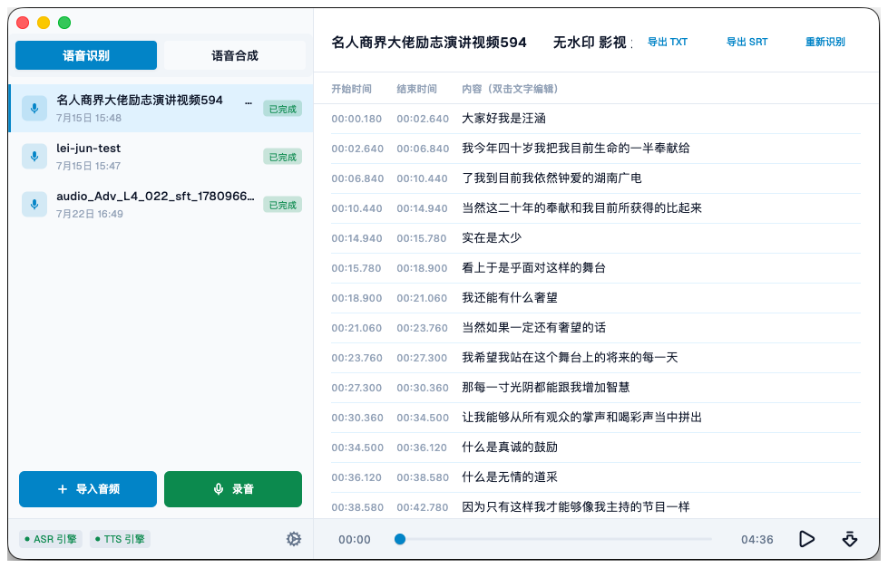
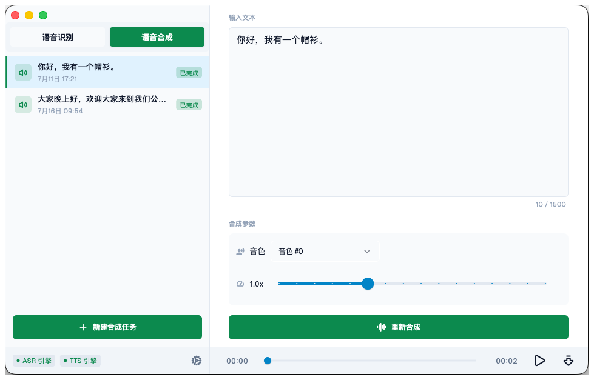
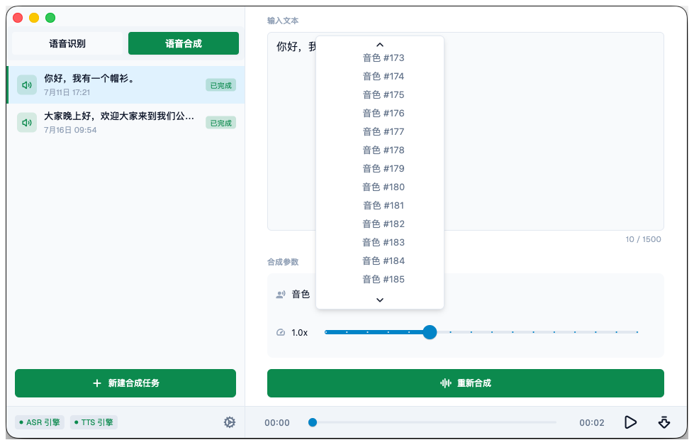
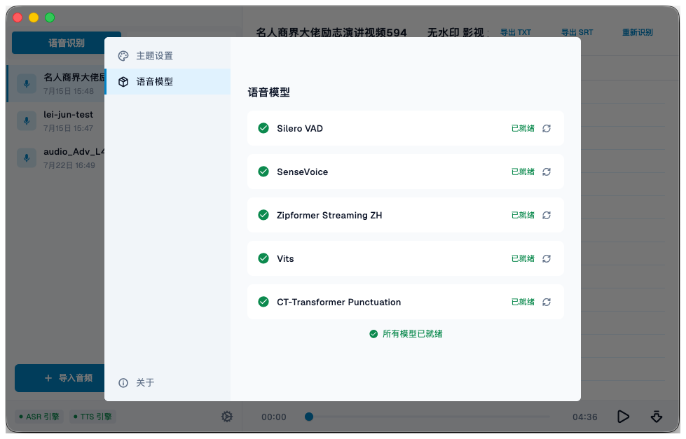

# Byte Voice

一个跑在 macOS 上的离线语音工具：把录音和音频转成带时间戳的文字，也能把文字读出来。识别和合成都在本机完成，模型下好之后可以断网用。

## 为什么做

把录音变成文字这件事，能用的服务太多了。但它们有个共同点：音频得先上传到别人的服务器。

我处理的东西大多不值得外发——会议、采访、随手录的备忘。花钱是一回事，更让我在意的是"上传"这个动作本身。

另外半边是反过来的需求：有时候想让电脑念一段字给我听（校对、试听文案），TTS 服务同样要求把文本发出去。

所以我想要的是一个很局部的工具：**识别和合成都跑在自己电脑上，模型下好之后就能断网用。**

## 关键的取舍

**模型不进安装包，第一次用的时候下载。** 五个模型加起来 483MB（Silero VAD 0.6MB、SenseVoice 166MB、Zipformer 流式 133MB、VITS 119MB、标点 65MB）。打进包里又臃肿又没法单独更新，现在是从一份 manifest 拉清单、比对版本、缺哪个下哪个，还支持断点续传。代价是第一次用要等下载，而且得联网。

**用现成的模型，不自己训。** VAD 用 Silero，识别用 SenseVoice（中英日韩粤），标点用 CT-Transformer，合成用 VITS 的中文多说话人模型——都是 sherpa-onnx 生态里现成的。代价是能力上限就是它们，比如没法区分说话人。

**两套识别模型，各管一头。** 导入文件用 SenseVoice 离线模型，更准；录音实时转写用 Zipformer 流式模型，边说边出字。代价是模型体积翻倍、代码里两条路径。

**重活全丢到后台 Isolate。** 转写和合成都是 CPU 密集的，跑在主线程界面会僵住。现在每来一个任务开一个 Isolate，处理完就销毁。代价是每次都要重新加载一遍模型。

**数据只落在本地。** 笔记、片段、合成历史都在本机 SQLite 里，音频文件放在应用沙盒目录；只有导出的时候需要你选一次文件夹。

## 转写是怎么做的

- **先切句**：Silero VAD（阈值 0.25、静音 0.3 秒算断句、单段最长 15 秒）把长音频切成一段段"确实有人在说话"的片段。
- **再识别**：每段送 SenseVoice，结果交给 CT-Transformer 补标点。
- **时间戳不靠猜**：用识别引擎吐出的字级时间戳来对齐句子。标点只用来断句，对完就把标点从显示文本里剥掉——所以界面上是干净的句子，导出 SRT 时是精确到毫秒的干净文本。
- **一行一句**：句末标点断开，逗号后满 8 个字断开，满 20 个字强制断开，不然语速快的人会顶出一整屏。

最后结果写进本地 SQLite，界面上双击就能改字。

## 语音合成

VITS 中文多说话人模型，**内置 187 个音色**，语速 0.5×–2.0×，单次最多 1500 字。合成本身也在后台 Isolate 里跑，用 CoreML 加速，完成后可以试听、导出音频，也可以改参数重新合成。

文本前后处理交给 sherpa-onnx 的规则文件：日期、数字、电话号码、多音字各一个——"2026 年 4 月 21 日""3.14""138xxxx"这些不会被念成一串数字。

合成历史也存在本机，和转写的笔记并排放在侧边栏里。

## 模型是这么管的

每个模型在 manifest 里有名字、架构类型、版本、文件列表、大小和校验值。App 启动时拉一次清单，比对本地版本，缺的提示下载、旧了提示更新，也可以删掉重下。五个模型对应五种能力：切句、离线识别、流式识别、标点恢复、语音合成——用不到的可以先不装。

## 踩过的坑

**开头吞字。** VAD 对文件开头的静音判断不稳，第一句经常丢头几个字。现在是在音频最前面人工垫 1.5 秒静音，算时间戳时再把这 1.5 秒减回去。

**复读机。** 相邻两段音频被切得重叠时，同一句话会被识别两次。解决办法是取音频时不允许越过上一段的结束点。

**界面假死。** 一开始整个文件一次性喂给引擎，转二十分钟录音的时候窗口直接卡住。现在分块喂、每处理几段让出一次事件循环，整个流程再丢进后台 Isolate。

**实时识别的时间轴。** 流式模型给的是"相对这句话开头"的时间，断句之后又从 0 开始。要让列表里显示绝对时间，就得自己拿累计喂进去的样本数当物理时钟（16kHz 下每 16 个样本 1 毫秒），断句时把基准时间往前推。

**标点模型抽风。** 偶尔会返回长得离谱的结果，加了个长度检查，超过原文三倍就退回不加标点的原文。

## 现在有什么、没有什么

有的：导入音频（wav / mp3 / m4a / ogg / flac / aac）、录音实时转写（最长 30 分钟）、双击改字、导出 TXT / Markdown / SRT、重新识别、本地模型管理、187 音色合成、深色模式、转写完成的系统通知。

还没有的：**目前只有 macOS 跑通**。Flutter 本来能覆盖三个平台，但 iOS 和 Windows 的构建文件被我删了，等核心稳定了再说。另外不能区分说话人，没有热词表，导入非 wav 格式需要系统里装了 ffmpeg。

## 关于隐私

识别和合成都跑在本机，唯一需要联网的动作是下载模型。没有账号、没有云同步，笔记、片段、合成历史都在本地 SQLite，音频文件在应用沙盒目录里。

## 关于协议

本仓库的代码以 [MIT](./LICENSE) 协议开源。运行时依赖的 sherpa-onnx、以及需要下载的语音模型都是第三方项目，各有各的协议，不随本仓库分发——细节写在 [NOTICE](./NOTICE) 里。

## 回头看

动手之前我以为难点在模型。真正花时间的全是工程：时间戳对齐、断句规则、VAD 的脾气、界面不能卡。

本地 AI 应用的门槛不在推理——模型装上就能跑——而在把它伺候好：不吞字、不重复、不卡界面、时间轴对得上。这些没有一件写在模型文档里。

> 把音频交给别人的服务器，是我最不想做的那一步。

## 跑起来

- 需要 macOS、Flutter（Dart 3.12+ / Flutter 3.44+）和 Xcode。
- `flutter pub get`，然后 `./run.sh` 启动（脚本里带了 `use_framework=1`，用来绕开 macOS 上 `OBJC_CLASS_$_NSArray` 的符号问题）。
- 第一次启动去设置里的"语音模型"下载模型；只需要转文字的话，VITS 那 119MB 可以不装。
- 导入 mp3 / m4a 等非 WAV 格式需要系统 PATH 里有 `ffmpeg`。
